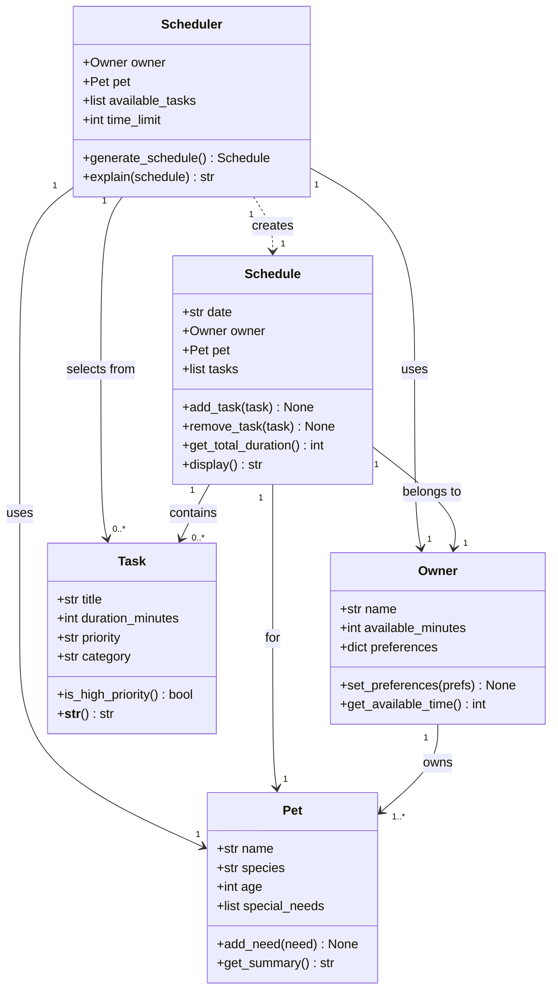

```mermaid
classDiagram
    class Owner {
        +str name
        +int available_minutes
        +dict preferences
        +set_preferences(prefs) None
        +get_available_time() int
    }

    class Pet {
        +str name
        +str species
        +int age
        +list special_needs
        +add_need(need) None
        +get_summary() str
    }

    class Task {
        +str title
        +int duration_minutes
        +str priority
        +str category
        +is_high_priority() bool
        +__str__() str
    }

    class Schedule {
        +str date
        +Owner owner
        +Pet pet
        +list tasks
        +add_task(task) None
        +remove_task(task) None
        +get_total_duration() int
        +display() str
    }

    class Scheduler {
        +Owner owner
        +Pet pet
        +list available_tasks
        +int time_limit
        +generate_schedule() Schedule
        +explain(schedule) str
    }

    Owner "1" --> "1..*" Pet : owns
    Schedule "1" --> "1" Owner : belongs to
    Schedule "1" --> "1" Pet : for
    Schedule "1" --> "0..*" Task : contains
    Scheduler "1" --> "1" Owner : uses
    Scheduler "1" --> "1" Pet : uses
    Scheduler "1" --> "0..*" Task : selects from
    Scheduler "1" ..> "1" Schedule : creates
```
